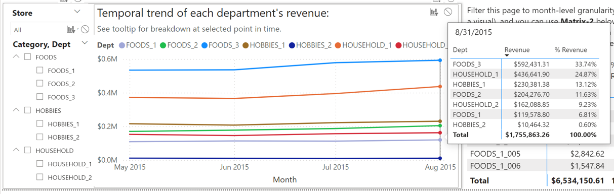
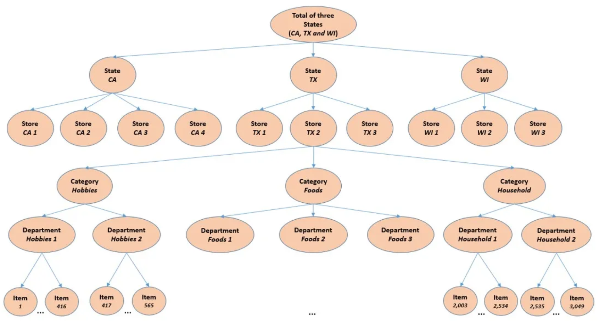

# Analysis of Walmart Sales Data

**Tools used:** Power BI (DAX), SQL, and Python.

**Dataset:** https://www.kaggle.com/competitions/m5-forecasting-accuracy/data

## Insights
In addition to the temporal revenue trends visualized by line charts and the aggregated metrics by column charts, my PBI report can be used to draw deeper insights such as:

- The categories, departments (which are subcategories), and individual items that contributed most to a month-to-month increase or decrease in revenue, both visually and quantitatively.
- Week-to-week revenue changes that examines the revenue generated during the week of notable events (e.g., holidays, sporting events, etc.) and compare them with neighboring weeks. Revenue changes are quantitatively broken down by categories, departments, and individual items.
- Generally, days that SNAP (food assistance) benefits are distributed see higher average daily sales than non-SNAP days. These differences are visualized and quantified across states and stores. Furthermore, the (percentage) breakdown of SNAP revenue and non-SNAP revenue by category, department, and item can be compared quantitatively.
  - In relation, revenue trends aggregated at the weekly level show pretty consistent spikes at the first two weeks of each month, which coincide with the part of the month when SNAP benefits are distributed.
- Time intelligence functions were applied throughout my report to compare revenue and revenue breakdown (including percentages) over week-to-week, month-to-month, and year-to-year time periods.

The insights that my report provides can be used to guide decisions on inventory, promotions, ads, and marketing.

The rest of this README will:

- Describe a few detailed examples of how insights can be generated from my PBI report.
- Cover the data transformation and data modelling processes.

### Example: Revenue Analysis

Let’s say I’m interested in the revenue of stores in CA. I want to answer questions such as: 
- Which store(s) performed differently from the others in terms of revenue generated?
- What are the main drivers of revenue change from one month to the next in terms of category, department, and item?

I visit the CA page of my report. From the line chart that plots store revenues, we can see that Store CA_2 had a sharp increase in revenue from 2015-05-01 to 2015-08-31 relative to the other three stores:

After adjusting the date range to this time frame and selecting CA_2 in the Store slicer, the line chart that visualizes departmental revenue demonstrates that this was largely driven by increased revenue from the FOODS_2, FOODS_3, and HOUSEHOLD_1 departments (I also created a custom tooltip for this visual that displays the sorted departmental revenue along with percentages):

The matrices provide further details. Using Matrix-1 and Matrix-2, I can see the contributions to monthly revenue and month-to-month change in revenue by the different categories, departments, and items. For example, if I examine the revenue growth from May 2015 to June 2015, I can generate the following insights:

1.	Store CA_2 saw a net growth in revenue of $55,287.90 from May to June. Increase in revenue from the FOODS_2 department made up 35.15% of the $55,287.90. Increase in revenue from FOODS_3 made up 41.45%, and increase in revenue from HOUSEHOLD_1 made up 13.26%. These were the top three departments in terms of contribution to the $55,287.90 net growth, which agrees with what we concluded visually from the line charts.

2.	I can use Matrix-2 to see which items contributed the most to the change in CA_2’s revenue from May to June through different filters. Over all categories and departments, the following items were the top six contributors to the revenue spike, and they all happened to be from the FOODS_3 department:

  I can modify the filter selections to view the top items within different filter contexts.

I can use the same process to derive insights like this for any of the other stores/states for any time period of interest. 

### Example: Events Analysis

The “Events Analysis” page of my report lets you to answer questions such as:

- Which events see a spike or drop in revenue the week of the event compared to the week before and after it? How does this performance compare over the years? What does this look like at the state/store level?
- What categories/departments/items drove this spike or drop in weekly revenue?

For example, I was able to generate the following insight: There is a notable decrease in revenue during the week of St. Patrick’s Day. That week generally saw a decrease in revenue compared to the previous week every year from 2011-2016, aggregated across all stores/states. 2012-2014 saw drops of more than 10% each year. In all six years, the week after the event also saw decreases. 
1.	WI stores experience the largest drop in revenue compared to the other states, especially due to Stores WI_2 and WI_3.
2.	Let’s look more closely at the week of St. Patrick’s Day in 2014 for Store WI_2, which saw a 22.55% drop in revenue that week. I can use Matrix-3 to see how the categories and departments contributed to the revenue decrease (below is Matrix-2 with the appropriate filters):
 

3.	With the same filter setting, I sort Matrix-4 by week-to-week revenue change in ascending order to rank the items whose revenue drop contributed most to total weekly revenue for WI_2:
 

FOODS_3_444, FOODS_2_266, FOODS_1_096, and FOODS_3_329 made up about 10% of the ($20,382.75) drop in weekly revenue.

Of course, an event is often not the only factor behind revenue changes, but this kind of insight would be valuable for business decisions regarding inventory, promotion, and advertising, especially if the dataset provided other relevant data such as those related to promotional campaigns.

### SNAP Revenue Analysis

Some brief background info: SNAP benefits are distributed for 10 days every month. These dates are the same each month depending on the month. For example: CA distributes them over the first 10 days of each month, but TX and WI spread the days out more throughout each month.
From the “SNAP Analysis” page, I want to answer: 

- What is the breakdown of revenue generated on SNAP days vs non-SNAP days? What percentage of the revenue comes from food sales on SNAP days vs non-SNAP days?
- How do the percentages compare across states and stores? Which food departments and items contribute most to the difference in percentage between SNAP-day sales and non-SNAP-day sales?

I can answer the above questions through different filter contexts via month/year and state/store. But across the entire dataset (across all dates, states, and stores), the daily average revenue is higher on SNAP days than non-SNAP days every month.

The FOODS category makes up 60.25% of SNAP-date revenue and 56.84% of non-SNAP-date revenue. Interestingly, CA and TX see this difference to be around a rather low 2-3%, but in WI, it is almost 6%. What’s behind this difference? Stores WI_2 and WI_3 are the main drivers. If you select just these two stores on the slicer, the matrix shows a 7.3% difference between “% Revenue SNAP” and “% Revenue Non-SNAP”:

The FOODS_2 department contributed most to the increased revenue on SNAP days. This information can be used to guide decisions on inventory and promotional/marketing campaigns for products in this department at Stores WI_2 and WI_3 during SNAP dates.

## Data Transformation

Among the files downloaded from Kaggle, I used the calendar, sales_train_evaluation, and sell_prices csv files, which are the ones I uploaded to this repo. The image below, which I obtained from a Medium article (https://towardsdatascience.com/m5-forecasting-accuracy-24d7f42130de) shows how the data is organized:

Extensive transformations were applied to these data tables to make them conducive for use in PBI.

### Sales Data Transformation with Python

I found it necessary to use Python to process the sales_train_evaluation.csv data due to the complexity of transforming it. It might be doable with SQL, but the level of complexity convinced me to use Python's Pandas library.

Below is a snippet of the original data table, which has 30,491 rows:

The columns continue numerically until "d_1941." The columns d_1 to d_1941 represent dates ranging from 2011-01-29 to 2016-06-19. The dates need to be in rows for use with PBI, and each date will have as many rows as there were (distinct) items sold in each store that day. Below is a snippet of the post-transformed data table, which has 1,048,576 rows:

I uploaded here my "sales_data_transformation.py" script, which performed this task.
