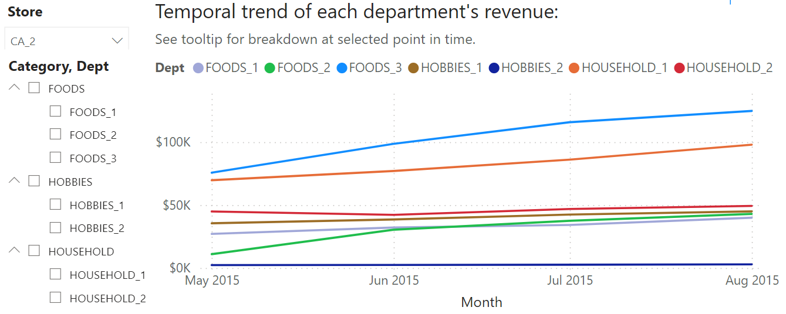
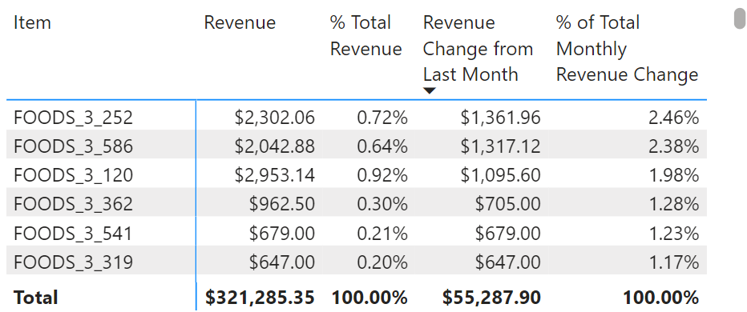

# Analysis of Walmart Sales Data

**Tools used:** Power BI (DAX), SQL, and Python.

**Dataset:** https://www.kaggle.com/competitions/m5-forecasting-accuracy/data

## Insights
In addition to the temporal revenue trends visualized by line charts and the aggregated metrics by column charts, my PBI report can be used to draw deeper insights such as:

- The categories, departments, and individual items that contributed most to a month-to-month increase or decrease in revenue, both visually and quantitatively.
- Week-to-week revenue changes that examines the revenue generated during the week of notable events (e.g., holidays, sporting events, etc.) and compare them with neighboring weeks. Revenue changes are quantitatively broken down by categories, departments, and individual items.
- Generally, days that SNAP (food assistance) benefits are distributed see higher average daily sales than non-SNAP days. These differences are visualized and quantified across states and stores. Furthermore, the (percentage) breakdown of SNAP revenue and non-SNAP revenue by category, department, and item can be compared quantitatively.
  - In relation, revenue trends aggregated at the weekly level show pretty consistent spikes at the first two weeks of each month, which coincide with the part of the month when SNAP benefits are distributed.
- Time intelligence functions were applied throughout my report to compare revenue and revenue breakdown (including percentages) over week-to-week, month-to-month, and year-to-year time periods.

The insights that my report provides can be used to guide decisions on inventory, promotions, ads, and marketing.

The rest of this README will:

- Describe a few detailed examples of how insights can be generated from my PBI report.
- Cover the data transformation and data modelling processes.

### Example: Revenue Analysis

Let’s say I’m interested in the revenue of stores in CA. I want to answer questions such as: 
- Which store(s) performed differently from the others in terms of revenue generated?
- What are the main drivers of revenue change from one month to the next in terms of category, department, and item?

I visit the CA page of my report. From the line chart that plots store revenues, we can see that Store CA_2 had a sharp increase in revenue from 2015-05-01 to 2015-08-31 relative to the other three stores:

After adjusting the date range to this time frame and selecting CA_2 in the Store slicer, the line chart that visualizes departmental revenue demonstrates that this was largely driven by increased revenue from the FOODS_2, FOODS_3, and HOUSEHOLD_1 departments:

The matrices provide further details. Using Matrix-1 and Matrix-2, I can see the contributions to monthly revenue and month-to-month change in revenue by the different categories, departments, and items. For example, if I examine the revenue growth from May 2015 to June 2015, I can generate the following insights:

1.	Store CA_2 saw a net growth in revenue of $55,287.90 from May to June. Increase in revenue from the FOODS_2 department made up 35.15% of the $55,287.90. Increase in revenue from FOODS_3 made up 41.45%, and increase in revenue from HOUSEHOLD_1 made up 13.26%. These were the top three departments in terms of contribution to the $55,287.90 net growth, which agrees with what we concluded visually from the line charts.

2.	I can use Matrix-2 to see which items contributed the most to the change in CA_2’s revenue from May to June through different filters. Over all categories and departments, the following items were the top six contributors to the revenue spike, and they all happened to be from the FOODS_3 department:

I can filter to view the top items within another attribute or multiple attributes. For example, I filter on the FOODS_2 department:

I can use the same process to derive insights like this for any of the other stores/states for any time period of interest. 

