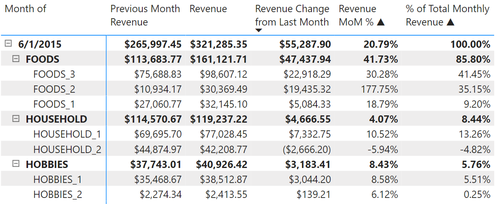
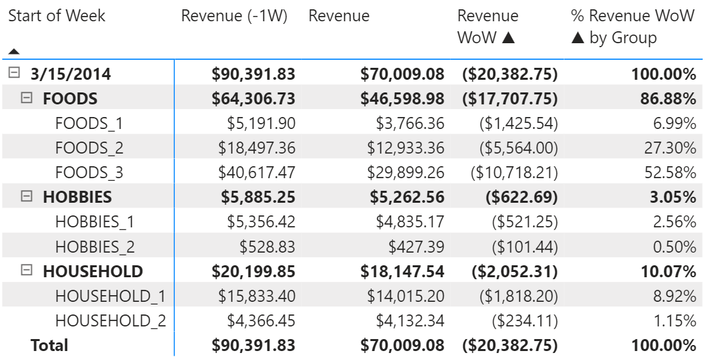

# Revenue Analysis of Walmart Sales Data

**Tools used:** Power BI (DAX), SQL, and Python.

**Dataset:** https://www.kaggle.com/competitions/m5-forecasting-accuracy/data

## Insights
In addition to the temporal revenue trends visualized by line charts and the aggregated metrics by column charts, my PBI Desktop report can be used to draw deeper insights such as:

- The categories (FOODS, HOBBIES, and HOUSEHOLD), departments (which are subcategories), and individual items that contributed most to a month-to-month increase or decrease in revenue, both visually and quantitatively.
- Weekly revenue generated during the week of notable events (e.g., holidays, major sporting events, etc.) compared with neighboring weeks. Revenue changes are quantitatively broken down by categories, departments, and individual items to enable comparison at those grains.
- Generally, days that SNAP (food assistance) benefits are distributed see higher average daily sales than non-SNAP days. These differences are visualized and quantified across states and stores. Furthermore, the (percentage) breakdown of SNAP revenue and non-SNAP revenue by category, department, and item can be compared quantitatively.
  - Revenue trends aggregated at the weekly level show consistent spikes at the first two weeks of each month, which coincide with the part of the month when SNAP benefits are distributed.
  - At the daily level, revenue spikes occur on Saturdays/Sundays.
- Time intelligence functions were applied throughout my report to compare revenue and revenue breakdown (by state, store, category, department, and item) over week-to-week, month-to-month, and year-to-year time periods.

The insights that my report provides can be used to guide decisions on promotional campaigns, and I could easily recreate this report with a [Quantity Sold] measure instead of [Revenue], which would provide actionable insights on inventory management.

The rest of this README will:

- Describe the files I've uploaded to this repo, and provide links to those that were too large to upload here.
- Go over how the Kaggle data is organized at a high-level.
- Describe a few detailed examples of how insights can be generated from my PBI report.
- Cover the data transformation and data modelling processes.
- Some notes on how I used Power BI.

## Project Files

- Among the files downloaded from Kaggle, I used the calendar, sales_train_evaluation, and sell_prices CSV files, which are uploaded to this repo. I also uploaded a CSV file called sales_data, which is the result of transforming sales_train_evaluation.CSV (this process is explained later). These files can be accessed here: 
- walmart_sales_data_transformation.py is my Python script that performs the said transformation above.
- m5-walmart.sql is my SQL script that applies further transformations to the data for loading into PBI. It also contains a few EDA code blocks.
- walmart-revenue-project.pdf is a PDF of my PBI report.
- MyPBI Desktop report can accessed here: 

## Organization of Data

The image below shows how the data is organized:

<p align="center">

</p>

In addition to dates, the calendar CSV file contains dates for events (e.g., holidays, major sporting events, etc.) and SNAP benefits. The sales_train_evaluation CSV contains data on quantities of items sold each day for each store. The sell_prices CSV contains week-to-week price data for every item (this price could vary from store to store and/or week-to-week).

## Example: Revenue Analysis

Let’s say I’m interested in the revenue of stores in CA. I want to answer questions such as: 
- Which store(s) performed differently from the others in terms of revenue generated?
- What are the main drivers of revenue change from one month to the next in terms of category, department, and item?

I visit the CA page of my report. From the line chart that plots store revenues, we can see that Store CA_2 had a sharp increase in revenue from 2015-05-01 to 2015-08-31 relative to the other three stores:

<p align="center">

</p>

After adjusting the date range to this time frame and selecting CA_2 in the Store slicer, the line chart that visualizes departmental revenue demonstrates that this was largely driven by increased revenue from the FOODS_2, FOODS_3, and HOUSEHOLD_1 departments (I also created a custom tooltip for this visual that displays the sorted departmental revenue along with percentages):

<p align="center">

</p>

The matrices provide further details. Using Matrix-1 and Matrix-2, I can see the contributions to monthly revenue and month-to-month change in revenue by the different categories, departments, and items. For example, if I examine the revenue growth from May 2015 to June 2015, I can generate the following insights:

1.	Store CA_2 saw a net growth in revenue of $55,287.90 from May to June. Increase in revenue from the FOODS_2 department made up 35.15% of the $55,287.90. Increase in revenue from FOODS_3 made up 41.45%, and increase in revenue from HOUSEHOLD_1 made up 13.26%. These were the top three departments in terms of contribution to the $55,287.90 net growth, which agrees with what we concluded visually from the line charts.

  <p align="center">
  
  </p>

2.	I can use Matrix-2 to see which items contributed the most to the change in CA_2’s revenue from May to June through different filters. Over all categories and departments, the following items were the top six contributors to the revenue spike, and they all happened to be from the FOODS_3 department:

  <p align="center">
  
  </p>

  I can modify the filter selections to view the top items within different filter contexts (ex: what are the ).

I can use the same process to derive insights like this for any of the other stores/states for a different time period.

## Example: Events Analysis

I acknowledge that the "Events Analysis" page of my report is a bit crowded and unintuitive, but I hope the instructions on it are clear. This page lets you answer questions such as:

- Which events see a spike or drop in revenue the week of the event compared to the week before and after it? How does this performance compare over the years? What does this look like at the state/store level?
- What categories/departments/items drove this spike or drop in weekly revenue?

For example, I was able to generate the following insight: There is a notable decrease in revenue during the week of St. Patrick’s Day. That week generally saw a decrease in revenue compared to the previous week every year from 2011-2016, aggregated across all stores/states. 2012-2014 saw drops of more than 10% each year. In all six years, the week after the event also saw decreases. 
1.	WI stores experience the largest drop in revenue compared to the other states, especially due to Stores WI_2 and WI_3.
2.	Let’s look more closely at the week of St. Patrick’s Day in 2014 for Store WI_2, which saw a 22.55%, or $20,382.75, drop in revenue that week. I can use Matrix-3 to see how the categories and departments contributed to the revenue decrease (below is Matrix-3 with the appropriate filters):
 
  <p align="center">
  
  </p>

3.	With the same filter context, I sort Matrix-4 by week-over-week (WoW) revenue change in ascending order to rank the items whose revenue drop contributed most to total weekly revenue for WI_2. This tells me that FOODS_3_444, FOODS_2_266, FOODS_1_096, and FOODS_3_329 made up about 10% of the $20,382.75 drop in weekly revenue:
 
  <p align="center">
  
  </p>

Of course, an event is often not the only factor behind revenue swings, but this kind of insight would be valuable for business decisions regarding inventory, promotion, and advertising, especially if the dataset provided other relevant data such as those related to promotional campaigns.

## SNAP Revenue Analysis

Some brief background info: SNAP benefits are distributed for 10 days every month. These dates are the same each month depending on the state. For example: CA distributes them over the first 10 days of each month, but TX and WI spread the days out more throughout the first half each month.
From the “SNAP Analysis” page, I want to answer: 

- What is the breakdown of revenue generated on SNAP days vs non-SNAP days? What percentage of the revenue comes from food sales on SNAP days vs non-SNAP days?
- How do the percentages compare across states and stores? Which food departments and items contribute most to the difference in percentage between SNAP-day sales and non-SNAP-day sales?

I can answer the above questions through different filter contexts via month/year and state/store. But across the entire dataset (across all dates, states, and stores), the daily average revenue is higher on SNAP days than non-SNAP days every month.

<p align="center">

</p>

The FOODS category makes up 60.25% of SNAP-date revenue and 56.84% of non-SNAP-date revenue. Interestingly, CA and TX see this difference to be around a rather low 2-3%, but in WI, it is almost 6%. What’s behind this 6%? Stores WI_2 and WI_3 are the main drivers. If you select just these two stores on the State/Store slicer, the matrix shows a 7.3% difference between “% Revenue SNAP” and “% Revenue Non-SNAP”:

<p align="center">

</p>

The FOODS_2 department contributed most to the increased revenue on SNAP days. This information can be used to guide decisions on inventory and promotional/marketing campaigns for products in this department at Stores WI_2 and WI_3 during SNAP dates.

## Data Transformation

Recall:

- I utilized the three CSV files uploaded to this repo as my dataset.
- In addition to dates, the calendar CSV file contains dates for events (e.g., holidays, major sporting events, etc.) and SNAP benefits. The sales_train_evaluation CSV contains data on quantities of items sold each day for each store. The sell_prices CSV contains week-to-week price data for every item (this price could differ from store to store given a particular week).

Extensive transformations were applied to the original data tables to make them conducive for use in PBI.

### Sales Data Transformation with Python

I found it necessary to use Python (Pandas) to process the sales_train_evaluation.CSV data because it has nearly 2,000 columns, and loading a table with so many columns into PostgreSQL is manually intensive.

Below is a snippet of the original data table, which has 30,491 rows:

<p align="center">

</p>

The columns continue numerically until "d_1941." The columns d_1 to d_1941 represent dates ranging from 2011-01-29 to 2016-06-19, and those columns contain the quantity of each item sold on that day. The dates need to be in rows for use with PBI, and each date will have as many rows as there were (distinct) items sold in each store that day. Below is a snippet of the post-transformed data table (uploaded to this repo as **sales_data.CSV**), which has 18,550,276 rows:

<p align="center">

</p>

I uploaded my **sales_data_transformation.py** script, which performed this task.

### Transformations with SQL (Postgres)

I have uploaded the SQL script that contains all the code blocks below for data transformation and some high-level EDA.

I loaded the transformed sales data (sales_data.CSV), calendar.CSV, and sell_prices.CSV files to PostgreSQL. I applied the following processing steps to the loaded data tables before creating them as views to be imported into PBI:

1.	I created a view (calendar_view) that added columns for month name and quarter to the calendar table:

	```
	drop view if exists calendar_view cascade;
 	create view calendar_view ("Date", "Week ID", "Weekday", "Day Number", "Month Number", "Month", "Quarter", "Year") as (
		select date, week_id, weekday, wday, month,
			case
				when month = 1 then 'January'
				when month = 2 then 'February'
				when month = 3 then 'March'
				when month = 4 then 'April'
				when month = 5 then 'May'
				when month = 6 then 'June'		
				when month = 7 then 'July'
				when month = 8 then 'August'
				when month = 9 then 'September'
				when month = 10 then 'October'
				when month = 11 then 'November'
				when month = 12 then 'December'
			end as month_name,
			case
				when month in (1, 2, 3) then 'Q1'
				when month in (4, 5, 6) then 'Q2'
				when month in (7, 8, 9) then 'Q3'
				when month in (10, 11, 12) then 'Q4'
			end as quarter,
			year
		from calendar
		order by date
	);
	```
	Below is the first 10 rows of calendar_view:

 	<p align="center">
	
	</p>

2.	Created a view (events_calendar) for event dates:

	```
	drop view if exists events_calendar;
 	create view events_calendar as (
		select date as "Date", event_name_1 as "Event Name", event_type_1 as "Event Type"
		from calendar
		where event_name_1 is not null
		union
		select date, event_name_2, event_type_2
		from calendar
		where event_name_2 is not null
	);
 	```

   	Below is the first 10 rows of events_calendar:
	
   	<p align="center">
	
	</p>

3.	I took the SNAP dates information from calendar.CSV and added them as a column to the data in sales_data.CSV.

	a. First step was to extract the dates, snap_CA, snap_TX, and snap_WI columns from the calendar table, which I used to create the view snap_calendar.
	
	```
	drop view if exists snap_calendar;
 	create view snap_calendar ("Date", "State", "SNAP") as ( 
		select date, 'CA' as "State", "snap_CA"
		from calendar
		union
		select date, 'TX' as "State", "snap_TX"
		from calendar
		union
		select date, 'WI' as "State", "snap_WI"
		from calendar
		order by date
	);
	```
	
	First 10 rows of snap_calendar:

	<p align="center">
	
	</p>
	
  	b. The statement below performs two join operations, which I'll explain:
	
	```
	drop view if exists sales_intermed_view cascade;
 	create view sales_intermed_view ("Date", "Week ID", "Item", "Dept", "Category", "Store", "State", "Quantity") as (
		with sales_dates as (
			select date, week_id, item_id, dept_id, cat_id, store_id, state_id, qty
			from sales s
			join (
				select date, week_id, d
				from calendar
			) dd
			on s.day = dd.d	
		)
		select sd.*, sc."SNAP"
		from sales_dates sd
		join snap_calendar sc
		on sd.date = sc."Date" and sd.state_id = sc."State"
	);
	```
	
   	The first join operation replaced “d_i” values (d_1, d_2, …, d_1941) with their corresponding dates (2011-01-29 to 2016-06-19). The second join added a column of 1's and 0's (i.e., True and False) as SNAP dates to sales_intermed_view (created above), which will eventually become sales_view.    	

4.	I took a few steps to add a column of unit prices for the item associated with each row in sales_intermed_view.

   	a. I created materialized views of sales_intermed_view and the prices table so that I could add indexes to them for query optimization:
	
	```
	drop materialized view if exists sales_intermed_mv cascade;
 	create materialized view sales_intermed_mv as (
		select * from sales_intermed_view
	);
	
	drop materialized view if exists prices_mv cascade;
 	create materialized view prices_mv ("Store", "Item", "Week ID", "Unit Price") as (
		select * from prices
	);
	```
	
   	b. I created indexes on the materialized views:
	
	```
	drop index if exists idx_sales_store_item;
	drop index if exists idx_prices_store_item;
 	create index idx_sales_store_item on sales_intermed_mv("Store", "Item", "Week ID");
	create index idx_prices_store_item on prices_mv("Store", "Item", "Week ID");
	```
	
   	 c. Thanks to indexing, the join operation below will run much more quicky (~1 min 30 sec) than without it (the query was still running after 30 min). Recall that I also have to join on "Week ID" to account for week-to-week item price changes.
	
	```
	drop materialized view if exists sales_info_mv cascade;
 	create materialized view sales_info_mv as (
		select smv.*,
			pmv."Unit Price"
		from sales_intermed_mv smv
		join prices_mv pmv
		on smv."Store" = pmv."Store" and smv."Item" = pmv."Item" and smv."Week ID" = pmv."Week ID"
	);
	```
	
   	d. Finally, I sort the materialized view (sales_info_mv) by date to create my sales_view:
	
	```
	drop view if exists sales_view;
 	create view sales_view as (
		select * from sales_info_mv
		order by "Date"
	);
	```
		
	  The first 10 rows sales_view:

	  <p align="center">
	  
	  </p>
  
5.	The views that I imported to PBI are: sales_view, events_calendar, and calendar_view.

### SQL EDA

My SQL script also contains some EDA queries.

- How many items in each department?

  ```
	with dept_item_list as (
	select "Dept", "Item"
	from sales_view
	group by "Dept", "Item"
	)
	select "Dept", count("Item")
	from dept_item_list
	group by "Dept";
  ```

  Output:

  <p align="center">
  
  </p>

- Revenue generated by each state?

  ```
	with state_revenues as (
		select "State",
			sum("Quantity" * "Unit Price") as "Revenue"
		from sales_info_mv
		group by "State"
	),
	total_revenue as (
		select sum("Revenue") as "Total Revenue"
		from state_revenues
	)
	select state_revenues.*,
		round(state_revenues."Revenue" / total_revenue."Total Revenue" * 100, 2) as "% Total Revenue"
	from state_revenues, total_revenue;
  ```

  Output:

  <p align="center">
  
  </p>

- Revenue generated by each store?

  ```
  	with store_revenues as (
	select "Store",
		sum("Quantity" * "Unit Price") as "Revenue"
	from sales_info_mv
	group by "Store"
	),
	total_revenue as (
		select sum("Revenue") as "Total Revenue"
		from store_revenues
	)
	select store_revenues.*,
		round(store_revenues."Revenue" / total_revenue."Total Revenue" * 100, 2) as "% Total Revenue"
	from store_revenues, total_revenue;
  ```

  Output:

  <p align="center">
  
  </p>  

- I computed the quarter-over-quarter (QOQ) % change in revenue for each store:

  ```
  drop materialized view if exists sales_price_qy_mv;
	create materialized view sales_price_qy_mv as (
		select sap_mv.*,
			cv."Quarter", cv."Year"
		from sales_info_mv sap_mv, 
			(select "Date", "Quarter", "Year" from calendar_view) cv
		where sap_mv."Date" = cv."Date"
	);
  	
	with qy_store_revenue as (
		select "Store", "Quarter", "Year", 
			sum("Quantity" * "Unit Price") as "Revenue"
		from sales_price_qy_mv
		group by "Store", "Year", "Quarter"
	),
	qoq_store_revenue as (
		select *, 
			lag("Revenue", 1) over (partition by "Store" order by "Year", "Quarter") as "Previous Q Revenue"
			-- "Revenue" over (partition by "Store" order by "Q-Y" rows between 1 preceding and current row) as "Previous Q Revenue"
		from qy_store_revenue
	)
	select "Store", "Quarter", "Year", "Revenue", 
		round(("Revenue" - "Previous Q Revenue")/"Previous Q Revenue" * 100, 2) as "QoQ % Change"
	from qoq_store_revenue;
  ```

  Below is the first 10 rows of the query result, which matches with the time intelligence matrix (on the "Time Ingelligence" page) in my PBI report:

  <p align="center">
  
  </p>

## Power BI: Data Model and DAX

Again, the three views I imported to PBI are: sales_view, events_calendar, and calendar_view. The calendar_view is my dimension table (I'll call this the calendar table from now on in the context of PBI), and the other two are fact tables (to be referred to as events and sales tables from hereon). Once I loaded them, I added three columns to the calendar table via Power Query. The columns are "Start of Month", "Start of Quarter", and "Start of Week"; each column is a transformation applied to the "Date" column. Below is a snippet of this modified calendar table:

<p align="center">

</p>

The two fact tables are connected to the dimension table via their date columns, resulting in the following schema:

<p align="center">

</p>

I applied the following DAX functions:

- Iterator functions such as SUMX to create the revenue measure and MAXX to extract the max date in a virtual table's column.
- CALCULATE function to compute revenue with various filter modifiers, such as REMOVEFILTER, ALLEXCEPT, and ALLSELECTED.
- CALCULATETABLE to create virtual tables within DAX queries.
- SUMMARIZE and COUNTROW functions to count the number of SNAP and non-SNAP days per month (I did not want to hard-code in 10 to equal the number of SNAP dates per month).
- HASONEVALUE function to apply the correct filters in matrices.
- Time intelligence functions such as DATEADD and PARALLELPERIOD.
- VALUES function to obtain distinct dates.
- CROSSFILTER function to activate bi-directional filtering and connect the events table to the sales table. I used this function to creat the [Revenue: Week of Event] measure, which is the nexus of my "Events Analysis" page.

I would also like to make note of a several more features of my report:

- The months of Jan. 2011 and Apr. – Jun. 2016 were filtered out of the report because of drastic spike and drop of revenue at those edge dates.
  - Jan. 2011 sales only include dates from Jan. 29 and later, so I filtered out those dates.
  - I'm not sure if fewer data points were provided for Apr. - Jun. 2016 dates or there was actually a drastic drop in revenue, but I decided to filter those out.
- The original dataset assigned values 1-7 to the days of the week, starting with 1 for Saturday, so, I have set the first day of the week to Saturday.
- I added columns “Start of Week”, “Start of Month”, and “Start of Quarter” to the calendar_view table via Power Query. This is how I plotted aggregate values in my temporal charts. This is why, for example, when temporal revenue visuals are drilled down to the month level, the months are labeled as MM/01/YYYY. I found this way to be easier for creating visuals rather than using date hierarchies.
- The YTD (year-to-date) revenue KPI cards display the YTD revenue starting from Jan. 1 of the last date in the filtered date range. For example, if the date filter is set from 2015-05-01 to 2015-09-15, then the YTD revenue is revenue from 2015-01-01 to 2015-09-15; and the Prev. YTD is revenue from 2014-01-01 to 2014-09-15.
- Similarly, the MTD (month-to-date) KPI cards display the MTD revenue starting from the beginning of the month that is at the end of the date filter range. Ex: if the date range is filtered to 2014-03-08 to 2014-03-22, the MTD revenue is revenue from 2014-03-01 to 2014-03-22; and the Prev. MTD is revenue from 2013-03-01 to 2013-03-22.

## Conclusion

In this personal project, I apply my skills in Python, SQL, and PowerBI (DAX) to:

- Transform the original dataset and load it to PBI for visual and tabular analyses.
- Perform extensive revenue analysis of Walmart sales data provided by M5/Kaggle.

With the insights that my PBI report provides, I showcase my ability to contribute to a professional setting with skills such as:

- Breaking down a business metric into components to analyze the drivers or causes behind how said metric changes.
  - This project focused on temporal changes, but it displays skills and throught processes that can be applied to other types of change, such as geographic, demographic, product-related, etc.
- Analyzing data by aggregating or combining different components.
- Generating insights that business users/stakeholders would find valuable.
- Bringing a strong understanding of Python, SQL, and DAX.
